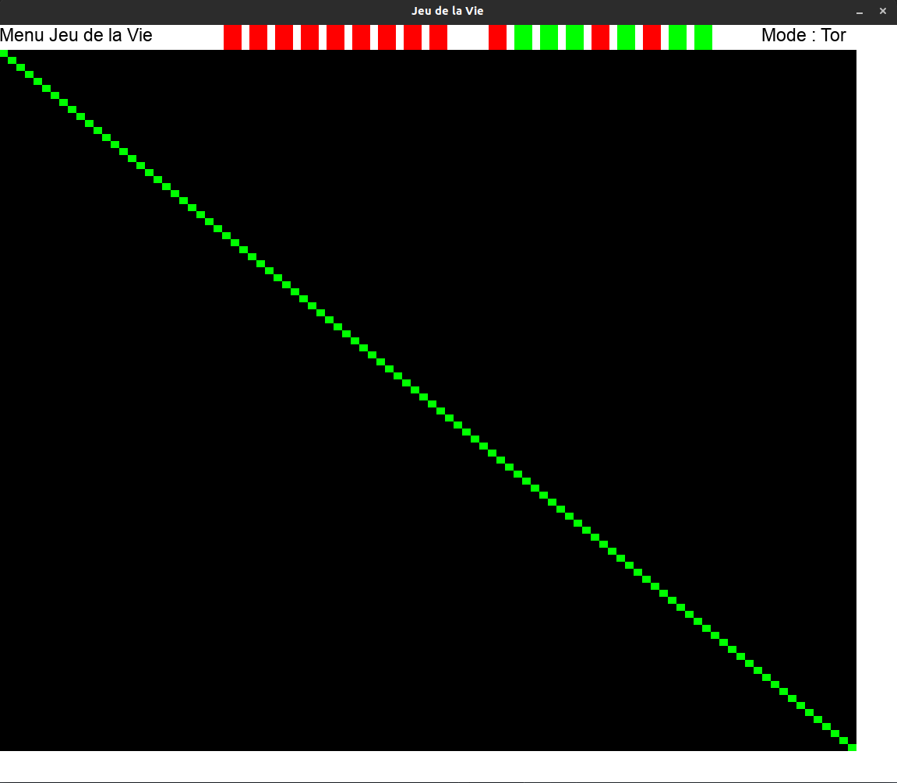

# Accueil
## Membres du Groupe 31

Bienvenue sur le site web des membres du groupe 31 du Projet ZZ1 2022, nous sommes

* BALLEJOS Lilian
* CORNUEZ Charlotte
* LEGER Bertrand

# Hébergement du projet

## Les programmes

Les programmes se trouvent tous dans le GitLab ISIMA de BALLEJOS Lilian à ce lien: [ici](https://gitlab.isima.fr/liballejos/projetzz1)

# TODO List
## Fonctionnement

Vous trouverez ici le programme de tout ce que l'on va faire durant ces 2 semaines jour par jour

### 20/06/22 (Lundi)
Avancé | Membre | Tâche
-------------- | -------------- | --------------
✔️| BALLEJOS Lilian | Mise en place du site
✔️| Commun | Mise en place d'un GitLab organisé
✔️| BALLEJOS Lilian | Xfenetré
✔️| LEGER BERTRAND  | Xfenetré
✔️| CORNUEZ Charlotte | Xfenetré
✔️| BALLEJOS Lilian | Animation Forme

### 21/06/22 (Mardi)

Avancé | Membre | Tâche
-------------- | -------------- | --------------
✔️| Commun | Répartition tâches jeu de la vie
✔️| BALLEJOS Lilian | Animation avec Texture
✔️| LEGER Bertrand | Animation Forme
✔️| CORNUEZ Charlotte | Animation Forme
✔️| CORNUEZ CHarlotte | Animation avec Texture
✔️| LEGER Bertrand | Animation avec Texture
✔️| Commun | Commencement du Jeu de la vie

### 21/06/22 (Mercredi)

Avancé | Membre | Tâche
-------------- | -------------- | --------------
✔️| Commun | Finalisation du Jeu de la vie
✔️| Commun | Répartition des tâches du "Premier Chef d'Oeuvre"
✔️| Commun | Commencement du premier Chef d'Oeuvre
✔️| BALLEJOS Lilian | Mise à jour du site en prévision de vendredi

### 22/06/22 (Jeudi)

Avancé | Membre | Tâche
-------------- | -------------- | --------------
✔️| BALLEJOS Lilian | Remplissage du site pour la présentation de vendredi
✔️| Commun |  Finalisation du Chef d'Oeuvre


# Xfenetré

## BALLEJOS Lilian

### Explication et Code

Mise en place d'un programme qui récupère les dimensions de l'écran principal et crée une animation de sinusoïde avec les fenêtres générées.

```c
/*Taille ecran*/

  SDL_DisplayMode current;
  SDL_GetCurrentDisplayMode(0, &current);
  int width = current.w;
  int height = current.h;
  //printf("%d %d\n", width, height);
  int milieu = height / 2 - TAILLE_FENETRE; // milieu ecran axe y
  int nbr_element = width / TAILLE_FENETRE; // nb d'element a generer

  /*PLacement et creation fenetre*/

  SDL_Window **tabWindow;
  tabWindow = (SDL_Window **)malloc(sizeof(SDL_Window *) * nbr_element);

  for (int i = 0; i < nbr_element; i++)
  {
    tabWindow[i] = SDL_CreateWindow(
        "Fenetre",                  // codage en utf8, donc accents possibles
        i * TAILLE_FENETRE, milieu, // a coté de sa voisine et au milieu de l'ecran en y
        TAILLE_FENETRE, TAILLE_FENETRE,
        0); // non redimensionnable

    if (tabWindow[i] == NULL)
    {
      SDL_Log("Error : SDL window %d creation - %s\n",
              i, SDL_GetError()); // échec de la création de la fenêtre
      SDL_Quit();                 // On referme la SDL
      exit(EXIT_FAILURE);
    }
  }

  /*ANimation 1*/
  /*on créé la courbe cosinus*/
  for (int i = 0; i < nbr_element; i++)
  {
    /*cos a chaque point "I * TAILLE_FENETRE*/
    float val_cos = cosf((i) * TAILLE_FENETRE);
    /*cos au carré pour osciller entre 0 et 1 et pas -1 et 1 puis d'amplitude de taille "hauteur ecran / 2 qu'on recentre au milieu avec + milieu /2"*/
    SDL_SetWindowPosition(tabWindow[i], i * TAILLE_FENETRE, (val_cos * val_cos * milieu) + milieu / 2);
    SDL_Delay(100);
  }

  /*Animation 2*/
  /*on fait osciller en changeant la valeur x des points avec une variante*/
  int variante = 0;
  while (variante < 100)
  {
    for (int i = 0; i < nbr_element; i++)
    {
      float val_cos = cosf((i + variante) * TAILLE_FENETRE);
      SDL_SetWindowPosition(tabWindow[i], i * TAILLE_FENETRE, (val_cos * val_cos * milieu) + milieu / 2);
    }
    variante++;
    printf("iteration n°%d\n", variante);
    SDL_Delay(100);
  }

  /*ANimation 3*/
  /*on replace au milieu*/
  for (int i = nbr_element - 1; i >= 0; i--)
  {
    SDL_SetWindowPosition(tabWindow[i], i * TAILLE_FENETRE, milieu);
    SDL_Delay(100);
  }

  /*Supression fenetre*/
  for (int i = 0; i < nbr_element; i++)
  {
    SDL_DestroyWindow(tabWindow[i]);
    printf("clear fenetre %d\n", i);
  }

  free(tabWindow);
```

### Vidéo

<p align="center"><iframe width="80%" height="315" src="https://www.youtube.com/embed/PmCJ4XlQqXs" title="YouTube video player" frameborder="0" allow="accelerometer; autoplay; clipboard-write; encrypted-media; gyroscope; picture-in-picture" allowfullscreen></iframe></p>

## LEGER Bertrand

### Explication et Code

Principe :
J'ouvre des fenêtres sur les côtés de l'écran en partant du milieu de la hauteur et du côté gauche et droit puis elles disparaissent. Puis j'ouvre des fenêtres et je les fais "spiraler" grâce au cosinus et
en augmentant le rayon du cercle à chaque itération, je finis par fermer toutes mes fenêtres une à une.

```c
SDL_Window *windows[NBREWINDOWS];

  SDL_DisplayMode current;
  SDL_GetCurrentDisplayMode(0, &current);
  int width = current.w;
  int height = current.h;

  float position_x_left = 0; // première fenêtre côté gauche au milieu de la largeur de l'écran
  float position_y_left = height / 2;

  float position_x_right = width; // première fenêtre côté droit au milieu de la largeur de l'écran
  float position_y_right = height / 2;

  /*Animation 1:
   *ligne de fenêtre de la moitié de la largeur de l'écran et de longueur = 1/3 de l'écran
   *Qui se referme une fois que la dernière est placée*/

  while (position_x_left < width / 2 && position_x_right > width / 2)
  {

    windows[i] = SDL_CreateWindow(
        "left",
        position_x_left, position_y_left,
        40, 20,
        0);

    windows[200 + i] = SDL_CreateWindow(
        "right",
        position_x_right, position_y_right,
        40, 20,
        SDL_WINDOW_RESIZABLE);

    if (windows[i] == NULL || windows[200 + i] == NULL)
    {
      SDL_Log("Error : SDL window %d creation - %s\n", i, SDL_GetError());
      SDL_Quit();
      exit(EXIT_FAILURE);
    }
    position_x_left = position_x_left + 15;
    SDL_SetWindowPosition(windows[i], position_x_left, position_y_left);

    position_x_right = position_x_right - 15;
    SDL_SetWindowPosition(windows[i], position_x_left, position_y_left);

    SDL_Delay(25);
    i++;
  }

  SDL_Delay(300);

  /*Animation 2 :
   *Je fais tourner fenêtres grâce aux coordonnées du cercle trigonométrique
   *A chaque itération le rayon du cercle va grandir*/

  int b;

  for (b = 0; b <= 100; b++)
  {

    if (b == 0)
    {

      for (j = 0; j < i; j++)
      {

        SDL_DestroyWindow(windows[j]);
        SDL_DestroyWindow(windows[200 + j]);
        SDL_Delay(75);
      }
    }
    windows[b] = SDL_CreateWindow(
        "left circle",
        position_x_left, position_y_left,
        40, 30,
        0);

    if (windows[b] == NULL)
    {
      SDL_Log("Error : SDL window %d creation - %s\n", b, SDL_GetError());
      SDL_Quit();
      exit(EXIT_FAILURE);
    }

    float pos_x = cosf(b) * 25 * (b / 4) + position_x_left;
    float pos_y = sinf(b) * 25 * (b / 4) + position_y_left;

    SDL_SetWindowPosition(windows[b], pos_x, pos_y);

    SDL_Delay(75);
  }

  SDL_Delay(3000);

  for (b = 100; b >= 0; b--)
  {

    SDL_DestroyWindow(windows[b]);
    SDL_Delay(20);
  }
```

### Vidéo

<p style="texte-align: center;"><iframe width="80%" height="315" src="https://www.youtube.com/embed/j7vuU87j4RA" title="YouTube video player" frameborder="0" allow="accelerometer; autoplay; clipboard-write; encrypted-media; gyroscope; picture-in-picture" allowfullscreen></iframe></p>

## CORNUEZ Charlotte

### Explication et Code
           
Les fenêtres s'affichent petit à petit pour former un U. Puis elles se rassemblent au milieu avant de partir chacune leur tour dans un des coins de l'écran.             

```c
/* Récupération de la taille de l'écran */

    SDL_DisplayMode current;
    SDL_GetCurrentDisplayMode(0, &current);
    int width = current.w;
    int height = current.h;
    // printf("%d %d\n", width,height);

    /* Création des fenêtres */
    for (i = 0; i < 14; i++)
    {
        TabWindows[i] = SDL_CreateWindow(
            "Fenêtres U",              // codage en utf8, donc accents possibles
            width / 3, height / 3 + j, // coin haut gauche en haut gauche de l'écran
            200, 200,                  // largeur = 400, hauteur = 300
            SDL_WINDOW_RESIZABLE);
        j = j + height / 50;

        /* Vérification de la création des fenêtres */

        if (TabWindows[i] == NULL)
        {
            SDL_Log("Error : SDL window 1 creation - %s\n",
                    SDL_GetError()); // échec de la création de la fenêtre
            SDL_Quit();              // On referme la SDL
            exit(EXIT_FAILURE);
        }
    }

    int k = j - height / 50;

    for (i = 14; i < 29; i++)
    {
        TabWindows[i] = SDL_CreateWindow(
            "Fenêtres U",                              // codage en utf8, donc accents possibles
            width / 3 + (i - 14) * 25, height / 3 + k, // coin haut gauche en haut gauche de l'écran
            200, 200,                                  // largeur = 400, hauteur = 300
            SDL_WINDOW_RESIZABLE);

        /* Vérification de la création des fenêtres */

        if (TabWindows[i] == NULL)
        {
            SDL_Log("Error : SDL window 1 creation - %s\n",
                    SDL_GetError()); // échec de la création de la fenêtre
            SDL_Quit();              // On referme la SDL
            exit(EXIT_FAILURE);
        }
    }

    for (i = 29; i < 44; i++)
    {
        TabWindows[i] = SDL_CreateWindow(
            "Fenêtres U",                          // codage en utf8, donc accents possibles
            width / 3 + (14 * 25), height / 3 + k, // coin haut gauche en haut gauche de l'écran
            200, 200,                              // largeur = 400, hauteur = 300
            SDL_WINDOW_RESIZABLE);
        k = k - height / 50;

        /* Vérification de la création des fenêtres */

        if (TabWindows[i] == NULL)
        {
            SDL_Log("Error : SDL window 1 creation - %s\n",
                    SDL_GetError()); // échec de la création de la fenêtre
            SDL_Quit();              // On referme la SDL
            exit(EXIT_FAILURE);
        }
    }
    SDL_Delay(100);
    /*Mise en place d'une étoile : les points vont aux quatres coins*/
    for (etoile; etoile < 45; etoile++)
    {
        SDL_SetWindowPosition(TabWindows[etoile], (width - 200) / 2, (height - 200) / 2);
    }
    SDL_Delay(100);
    for (etoile = 0; etoile < 44; etoile += 4)
    {
        for (int x = (width - 200) / 2; x > 0; x--)
        {
            SDL_SetWindowPosition(TabWindows[etoile], x, ((width - 200) / (height - 200)) * x);

            SDL_Delay(1);
        }
        for (int x = width / 2; x < width; x++)
        {
            SDL_SetWindowPosition(TabWindows[etoile + 3], x, (width / height) * x);

            SDL_Delay(1);
        }
        for (int y = width / 2; y < width; y++)
        {
            SDL_SetWindowPosition(TabWindows[etoile + 2], y, ((height - 2 * width) / width) * y + width);

            SDL_Delay(1);
        }
        for (int y = width / 2; y > 0; y--)
        {
            SDL_SetWindowPosition(TabWindows[etoile + 1], y, ((height - 2 * width) / width) * y + width);
            printf("%d \n", ((height - 2 * width) / width) * y + width);
            SDL_Delay(1);
        }
    }

    SDL_Delay(200);

    /* Fermeture des fenêtres */

    for (i = 45; i > 0; i--)
    {
        SDL_DestroyWindow(TabWindows[i]);
    }

```

### Vidéo

<p style="text-align: center;"><iframe width="80%" height="315" src="https://www.youtube.com/embed/CKo6G8Bd3j0" title="YouTube video player" frameborder="0" allow="accelerometer; autoplay; clipboard-write; encrypted-media; gyroscope; picture-in-picture" allowfullscreen></iframe></p>


# Animation Forme

## BALLEJOS Lilian

### Explication et Code

Mise en place d'un programme qui crée une fenêtre blanche et fait apparaître deux ellipses qui se croisent à intervalles réguliers et forment des ronds.
Pour faire cela, il a suffit de changer le rayon des cercles sur les composantes X et Y en le décalant de 10 de taille. Ensuite on inverse le rayon des composante X et Y entre les deux ellipses afin de les inverser entre elles ! De plus on joue avec les composantes de couleur pour changer la couleur des carrés qui forment les ellipses.

```c
void draw(SDL_Renderer *renderer, int largeur, int hauteur)
{
    /*Tableau de rectangle assez petit pour sembler etre des points*/
    SDL_Rect *rectangles = (SDL_Rect *)malloc(sizeof(SDL_Rect) * NBR_RECTANGLE);
    SDL_Rect *rectangles2 = (SDL_Rect *)malloc(sizeof(SDL_Rect) * NBR_RECTANGLE);
    int cercleTailleX = 100;
    int cercleTailleY = 200; /*taille des cercles pas la même pour avoir alternance ellispse et cercle*/
    int couleurR = 0;
    int couleurG = 20; /*couleur varie*/
    int couleurB = 10;
    float interation = 0;
    while (interation < 1000)
    {
        SDL_SetRenderDrawColor(renderer, 255, 255, 255, 255);                // fond blanc
        SDL_RenderClear(renderer);                                           // efface le rendu précédent
        SDL_SetRenderDrawColor(renderer, couleurR, couleurG, couleurB, 255); // couleur rectangle
        for (int i = 0; i < NBR_RECTANGLE; i++)
        {
            float valCos = cosf(i);
            float valSin = sinf(i);
            rectangles[i].x = cercleTailleX * valCos + largeur / 2;
            rectangles[i].y = cercleTailleY * valSin + hauteur / 2;
            rectangles[i].w = TAILLE_RECT;
            rectangles[i].h = TAILLE_RECT;
            SDL_RenderFillRect(renderer, &rectangles[i]); // on applique le rectangle
        }
        for (int i = 0; i < NBR_RECTANGLE; i++)
        {
            float valCos = cosf(i);
            float valSin = sinf(i); /*on inverse les largeur x et y avec le premier pour avoir une belle forme*/
            rectangles[i].x = cercleTailleY * valCos + largeur / 2;
            rectangles[i].y = cercleTailleX * valSin + hauteur / 2;
            rectangles[i].w = TAILLE_RECT;
            rectangles[i].h = TAILLE_RECT;
            SDL_RenderFillRect(renderer, &rectangles[i]); // on applique le rectangle
        }

        cercleTailleX = (cercleTailleX + 10) % 300;
        cercleTailleY = (cercleTailleY + 10) % 400;
        couleurR = (couleurR + 5) % 200;
        couleurG = (couleurG + 5) % 200; // modulo 200 pour eviter le blanc en 255
        couleurB = (couleurB + 5) % 200;
        SDL_RenderPresent(renderer); // on charge le rendu
        SDL_Delay(75);
        interation++;
    }

    free(rectangles);
    free(rectangles2);
}

```

### Vidéo

<p align="center"><iframe width="80%" height="315" src="https://www.youtube.com/embed/9enCd_bTOAw" title="YouTube video player" frameborder="0" allow="accelerometer; autoplay; clipboard-write; encrypted-media; gyroscope; picture-in-picture" allowfullscreen></iframe></p>


## CORNUEZ Charlotte

### Explication et Code

Le but de ce programme est de créer un cube qui tombe sur une pente.                               
Pour cela, on crée d'abord un rectangle de taille 1920*1080 dans lequel on crée une pente à l'aide d'une droite.
Un cube orange descend petit à petit la pente pour arriver sur le plat.                 

```c

void draw(SDL_Renderer* renderer) {                                 // Je pense que vous allez faire moins laid :)
  SDL_Rect rectangle,cube;                                                             

  SDL_SetRenderDrawColor(renderer,                                                
                         255, 255, 255,                                  // mode Red, Green, Blue (tous dans 0..255)
                         255);                                      // 0 = transparent ; 255 = opaque
  rectangle.x = 0;                                                  // x haut gauche du rectangle
  rectangle.y = 0;                                                  // y haut gauche du rectangle
  rectangle.w = 1920;                                                // sa largeur (w = width)
  rectangle.h = 1080;                                                // sa hauteur (h = height)

  SDL_RenderFillRect(renderer, &rectangle);                         


  
  SDL_SetRenderDrawColor(renderer, 0, 0, 0, 255);                   
  SDL_RenderDrawLine(renderer,                                      
                     0, 0,                                          // x,y du point de la première extrémité
                     600, 500);                                     // x,y seconde extrémité

  SDL_SetRenderDrawColor(renderer,0,0,0,255);
  SDL_RenderDrawLine(renderer,
                      600,500,
                      1920, 500);

  

  SDL_SetRenderDrawColor(renderer, 253,108,58,255);
  cube.x=100;
  cube.y=37;
  cube.w=50;
  cube.h=50;
  SDL_RenderFillRect(renderer, &cube);

  SDL_RenderPresent(renderer);

  
  SDL_Delay(1000);
  
  SDL_Rect rectangle1,cube1;                                                             

  SDL_SetRenderDrawColor(renderer,                                                
                         255, 255, 255,                                  // mode Red, Green, Blue (tous dans 0..255)
                         255);                                      // 0 = transparent ; 255 = opaque
  rectangle1.x = 0;                                                  // x haut gauche du rectangle
  rectangle1.y = 0;                                                  // y haut gauche du rectangle
  rectangle1.w = 1920;                                                // sa largeur (w = width)
  rectangle1.h = 1080;                                                // sa hauteur (h = height)

  SDL_RenderFillRect(renderer, &rectangle1);                         


  
  SDL_SetRenderDrawColor(renderer, 0, 0, 0, 255);                   
  SDL_RenderDrawLine(renderer,                                      
                     0, 0,                                          // x,y du point de la première extrémité
                     600, 500);                                     // x,y seconde extrémité

  SDL_SetRenderDrawColor(renderer,0,0,0,255);
  SDL_RenderDrawLine(renderer,
                      600,500,
                      1920, 500);

  

  SDL_SetRenderDrawColor(renderer, 253,108,58,255);
  cube1.x=200;
  cube1.y=115;
  cube1.w=50;
  cube1.h=50;
  SDL_RenderFillRect(renderer, &cube1);
  SDL_RenderPresent(renderer);

  
  SDL_Delay(1000);
  
  SDL_Rect rectangle2,cube2;                                                             

  SDL_SetRenderDrawColor(renderer,                                                
                         255, 255, 255,                                  // mode Red, Green, Blue (tous dans 0..255)
                         255);                                      // 0 = transparent ; 255 = opaque
  rectangle2.x = 0;                                                  // x haut gauche du rectangle
  rectangle2.y = 0;                                                  // y haut gauche du rectangle
  rectangle2.w = 1920;                                                // sa largeur (w = width)
  rectangle2.h = 1080;                                                // sa hauteur (h = height)

  SDL_RenderFillRect(renderer, &rectangle2);                         


  
  SDL_SetRenderDrawColor(renderer, 0, 0, 0, 255);                   
  SDL_RenderDrawLine(renderer,                                      
                     0, 0,                                          // x,y du point de la première extrémité
                     600, 500);                                     // x,y seconde extrémité

  SDL_SetRenderDrawColor(renderer,0,0,0,255);
  SDL_RenderDrawLine(renderer,
                      600,500,
                      1920, 500);

  

  SDL_SetRenderDrawColor(renderer, 253,108,58,255);
  cube2.x=300;
  cube2.y=197;
  cube2.w=50;
  cube2.h=50;
  SDL_RenderFillRect(renderer, &cube2);
  
  SDL_RenderPresent(renderer);

  
  SDL_Delay(1000);
  
  SDL_Rect rectangle3,cube3;                                                             

  SDL_SetRenderDrawColor(renderer,                                                
                         255, 255, 255,                                  // mode Red, Green, Blue (tous dans 0..255)
                         255);                                      // 0 = transparent ; 255 = opaque
  rectangle3.x = 0;                                                  // x haut gauche du rectangle
  rectangle3.y = 0;                                                  // y haut gauche du rectangle
  rectangle3.w = 1920;                                                // sa largeur (w = width)
  rectangle3.h = 1080;                                                // sa hauteur (h = height)

  SDL_RenderFillRect(renderer, &rectangle3);                         


  
  SDL_SetRenderDrawColor(renderer, 0, 0, 0, 255);                   
  SDL_RenderDrawLine(renderer,                                      
                     0, 0,                                          // x,y du point de la première extrémité
                     600, 500);                                     // x,y seconde extrémité

  SDL_SetRenderDrawColor(renderer,0,0,0,255);
  SDL_RenderDrawLine(renderer,
                      600,500,
                      1920, 500);

  

  SDL_SetRenderDrawColor(renderer, 253,108,58,255);
  cube3.x=400;
  cube3.y=280;
  cube3.w=50;
  cube3.h=50;
  SDL_RenderFillRect(renderer, &cube3);

  SDL_RenderPresent(renderer);

  
  SDL_Delay(1000);
  
  SDL_Rect rectangle4,cube4;                                                             

  SDL_SetRenderDrawColor(renderer,                                                
                         255, 255, 255,                                  // mode Red, Green, Blue (tous dans 0..255)
                         255);                                      // 0 = transparent ; 255 = opaque
  rectangle4.x = 0;                                                  // x haut gauche du rectangle
  rectangle4.y = 0;                                                  // y haut gauche du rectangle
  rectangle4.w = 1920;                                                // sa largeur (w = width)
  rectangle4.h = 1080;                                                // sa hauteur (h = height)

  SDL_RenderFillRect(renderer, &rectangle4);                         


  
  SDL_SetRenderDrawColor(renderer, 0, 0, 0, 255);                   
  SDL_RenderDrawLine(renderer,                                      
                     0, 0,                                          // x,y du point de la première extrémité
                     600, 500);                                     // x,y seconde extrémité

  SDL_SetRenderDrawColor(renderer,0,0,0,255);
  SDL_RenderDrawLine(renderer,
                      600,500,
                      1920, 500);

  

  SDL_SetRenderDrawColor(renderer, 253,108,58,255);
  cube4.x=500;
  cube4.y=365;
  cube4.w=50;
  cube4.h=50;
  SDL_RenderFillRect(renderer, &cube4);

SDL_RenderPresent(renderer);

  
  SDL_Delay(1000);
  
  SDL_Rect rectangle5,cube5;                                                             

  SDL_SetRenderDrawColor(renderer,                                                
                         255, 255, 255,                                  // mode Red, Green, Blue (tous dans 0..255)
                         255);                                      // 0 = transparent ; 255 = opaque
  rectangle5.x = 0;                                                  // x haut gauche du rectangle
  rectangle5.y = 0;                                                  // y haut gauche du rectangle
  rectangle5.w = 1920;                                                // sa largeur (w = width)
  rectangle5.h = 1080;                                                // sa hauteur (h = height)

  SDL_RenderFillRect(renderer, &rectangle5);                         


  
  SDL_SetRenderDrawColor(renderer, 0, 0, 0, 255);                   
  SDL_RenderDrawLine(renderer,                                      
                     0, 0,                                          // x,y du point de la première extrémité
                     600, 500);                                     // x,y seconde extrémité

  SDL_SetRenderDrawColor(renderer,0,0,0,255);
  SDL_RenderDrawLine(renderer,
                      600,500,
                      1920, 500);

  

  SDL_SetRenderDrawColor(renderer, 253,108,58,255);
  cube5.x=600;
  cube5.y=450;
  cube5.w=50;
  cube5.h=50;
  SDL_RenderFillRect(renderer, &cube5);

  SDL_RenderPresent(renderer);

  
  SDL_Delay(1000);
  
  SDL_Rect rectangle6,cube6;                                                             

  SDL_SetRenderDrawColor(renderer,                                                
                         255, 255, 255,                                  // mode Red, Green, Blue (tous dans 0..255)
                         255);                                      // 0 = transparent ; 255 = opaque
  rectangle6.x = 0;                                                  // x haut gauche du rectangle
  rectangle6.y = 0;                                                  // y haut gauche du rectangle
  rectangle6.w = 1920;                                                // sa largeur (w = width)
  rectangle6.h = 1080;                                                // sa hauteur (h = height)

  SDL_RenderFillRect(renderer, &rectangle6);                         


  
  SDL_SetRenderDrawColor(renderer, 0, 0, 0, 255);                   
  SDL_RenderDrawLine(renderer,                                      
                     0, 0,                                          // x,y du point de la première extrémité
                     600, 500);                                     // x,y seconde extrémité

  SDL_SetRenderDrawColor(renderer,0,0,0,255);
  SDL_RenderDrawLine(renderer,
                      600,500,
                      1920, 500);

  

  SDL_SetRenderDrawColor(renderer, 253,108,58,255);
  cube6.x=700;
  cube6.y=450;
  cube6.w=50;
  cube6.h=50;
  SDL_RenderFillRect(renderer, &cube6);

  
}
```
### Vidéo

<p style="text-align: center;"><iframe width="80%" height="315" src="https://www.youtube.com/embed/0oiR6EIlI3Q" title="YouTube video player" frameborder="0" allow="accelerometer; autoplay; clipboard-write; encrypted-media; gyroscope; picture-in-picture" allowfullscreen></iframe></p>

## LEGER Bertrand

### Explication et Code

Principe
Faire afficher une fenêtre, mettre le fond de la fenêtre en bleu fonçé 
Faire apparaître des lignes, représentant la pluie, qui apparaissent aléatoirement
Rajouter des cercles au point d'impact pour faire un effet d'eau touchant de l'eau

```c
void drawCircle(SDL_Renderer* renderer, int centre_x, int centre_y, int rayon_x, int rayon_y){
  for( float angle = 0 ; angle < 2*M_PI; angle += M_PI / 4000){
    SDL_RenderDrawPoint(renderer,
			centre_x + rayon_x * cos(angle),
			centre_y + rayon_y * sin(angle));
  }  
}


void draw(SDL_Renderer* renderer) {                                
  SDL_Rect rectangle;                                                             
  
  SDL_SetRenderDrawColor(renderer,                                                
                         37, 25, 133,                               // mode Red, Green, Blue (tous dans 0..255)
                         255);                                      // 0 = transparent ; 255 = opaque
  rectangle.x = 0;
  // x haut gauche du rectangle
  rectangle.y = 0;                                                  // y haut gauche du rectangle
  rectangle.w = 600;                                                // sa largeur (w = width)
  rectangle.h = 600;                                                // sa hauteur (h = height)

  SDL_RenderFillRect(renderer, &rectangle);                         

  SDL_SetRenderDrawColor(renderer, 224, 222, 238, 255);                   
  

  for(int m = 0; m < 20; m++){
    int pos_x_deb = rand()% 600;
    int pos_y_deb = rand()% 600;
    int pos_x_fin = pos_x_deb - rand()%50;
    int pos_y_fin = pos_y_deb + rand()%600 ;

    
    SDL_RenderDrawLine(renderer,                                      
		       pos_x_deb, pos_y_deb,                                      // x,y du point de la première extrémité
		       pos_x_fin, pos_y_fin);                                     // x,y seconde extrémité
  
  drawCircle(renderer,pos_x_fin,pos_y_fin,35,23);
  drawCircle(renderer,pos_x_fin,pos_y_fin,20,17);
  drawCircle(renderer,pos_x_fin,pos_y_fin,7,5);
  }

}
```

### Vidéo

<p style="text-align: center;"><iframe width="80%" height="315" src="https://www.youtube.com/embed/3bOyuSg8Ctk" title="YouTube video player" frameborder="0" allow="accelerometer; autoplay; clipboard-write; encrypted-media; gyroscope; picture-in-picture" allowfullscreen></iframe></p>


# Animation avec Texture

## BALLEJOS Lilian

### Explication et Code

Placement d'une image de fond de nuage en mouvement qui va de gauche à droite et se replace à gauche quand elle va déborder !
J'ai ensuite posé une texture de sol **très** inspirée de l'univers d'un plombier italien rouge.
Ensuite j'affiche frame par frame un oiseau qui traverse l'écran de gauche à droite !

```c
// placement fond
void placementTexture(SDL_Texture *my_texture, SDL_Window *window,
                      SDL_Renderer *renderer)
{
    SDL_Rect
        source = {0},
        window_dimensions = {0},
        destination = {0};

    SDL_GetWindowSize(
        window, &window_dimensions.w,
        &window_dimensions.h); // Récupération des dimensions de la fenêtre
    SDL_QueryTexture(my_texture, NULL, NULL,
                     &source.w, &source.h); // Récupération des dimensions de l'image

    destination = window_dimensions; // On fixe les dimensions de l'affichage à  celles de la fenêtre

    /* On veut afficher la texture de façon à ce que l'image occupe la totalité de la fenêtre */

    SDL_RenderCopy(renderer, my_texture,
                   &source,
                   &destination); // Création de l'élément à afficher
}

void anim(SDL_Texture *ciel,
          SDL_Window *window,
          SDL_Renderer *renderer,
          SDL_Texture *sol,
          SDL_Texture *oiseau)
{

    /* perso*/
    SDL_Rect
        source2 = {0},            // Rectangle définissant la zone totale de la planche
        window_dimensions2 = {0}, // Rectangle définissant la fenêtre, on n'utilisera que largeur et hauteur
        destination2 = {0},       // Rectangle définissant où la zone_source doit être déposée dans le renderer
        state2 = {0};             // Rectangle de la vignette en cours dans la planche

    SDL_GetWindowSize(window, // Récupération des dimensions de la fenêtre
                      &window_dimensions2.w,
                      &window_dimensions2.h);

    SDL_QueryTexture(oiseau, // Récupération des dimensions de l'image
                     NULL, NULL,
                     &source2.w, &source2.h);

    printf("dim image %d %d\n", source2.w, source2.h);

    int nb_images = 5;
    int offset_x = source2.w / nb_images, // 5 frame par ligne
        offset_y = source2.h / 3;         // 3 lignes

    state2.x = 0;
    state2.y = 0; // premiere ligne
    state2.w = offset_x;
    state2.h = offset_y;

    printf("offeset %d %d\n", offset_x, offset_y);

    destination2.w = offset_x;
    destination2.h = offset_y;
    destination2.y = (window_dimensions2.h / 2) - destination2.h; // La course se fait en milieu d'écran (en vertical)

    printf("destination H et W %d %d\n", destination2.w, destination2.h);

    /* fond */
    SDL_Rect
        source = {0},            // Rectangle définissant la zone de la texture à récupérer
        window_dimensions = {0}, // Rectangle définissant la fenêtre, on n'utilisera que largeur et hauteur
        destination = {0};       // Rectangle définissant où la zone_source doit être déposée dans le renderer

    SDL_GetWindowSize(
        window, &window_dimensions.w,
        &window_dimensions.h); // Récupération des dimensions de la fenêtre

    SDL_QueryTexture(ciel, NULL, NULL,
                     &source.w,
                     &source.h); // Récupération des dimensions de l'image

    float zoom = 1.5;                // Facteur de zoom entre l'image source et l'image affichée pour fond
    destination.w = source.w * zoom; // On applique le zoom sur la largeur
    destination.h = source.h * zoom; // On applique le zoom sur la hauteur
    destination.x = -source.w / 2;   // au depart a droite

    int speed = 12; // vitesse de déplacement
    int x = 0;      // depart oiseau
    SDL_bool program_on = SDL_TRUE;
    SDL_Event event;

    while (program_on)
    {

        while (SDL_PollEvent(&event))
        {
            switch (event.type)
            {
            case SDL_QUIT:
                program_on = SDL_FALSE;
                break;

            default:
                break;
            }
        }
        /*animation*/
        x += speed;
        if (destination.x > 0) // on atteind le bout de l'image le fond retourne a sa place
        {
            destination.x = -source.w / 2;
        }
        else
        {
            destination.x += 10;
        }
        destination2.x = x;
        state2.x += offset_x;  // On passe à la vignette suivante dans l'image
        state2.x %= source2.w; // On réinitialise à 0 si on dépasse la largeur

        printf("etat %d %d\n", state2.x, state2.y);
        printf("destination %d %d\n", destination2.x, destination2.y);

        SDL_RenderClear(renderer);                                // Effacer l'image précédente
        SDL_RenderCopy(renderer, ciel, &source, &destination);    // Préparation de l'affichage
        placementTexture(sol, window, renderer);                  // Afficher le sol
        SDL_RenderCopy(renderer, oiseau, &state2, &destination2); // personnage
        SDL_RenderPresent(renderer);                              // Affichage de la nouvelle image
        SDL_Delay(30);
        if(x > window_dimensions.w)
            program_on = !program_on;
    }
}
```

### Vidéo

<p style="text-align: center;"><iframe width="80%" height="315" src="https://www.youtube.com/embed/XjAD57nNzGw" title="YouTube video player" frameborder="0" allow="accelerometer; autoplay; clipboard-write; encrypted-media; gyroscope; picture-in-picture" allowfullscreen></iframe></p>

## LEGER Bertrand

### Explication et Code

Principe  : afficher le ciel en fond, le panier à droite et faire arriver le ballon de basket (en le faisant tourner) dans le panier avec un arc parabolique typique d'un tir de basketball.

```c
void AffichageObjet(SDL_Renderer *renderer, SDL_Texture *objet, SDL_Rect pos)
{
  SDL_Rect image = {0};
  SDL_QueryTexture(objet, NULL, NULL, &image.w, &image.h);
  SDL_RenderCopy(renderer, objet, &image, &pos);
  
}


void Animation(SDL_Window *window,
	       SDL_Renderer *renderer,
	       SDL_Texture *panier,
	       SDL_Texture *ciel,
	       SDL_Texture *ballon)
{

 
  /* fond */
  SDL_Rect
    source = {0},            // Rectangle définissant la zone de la texture à récupérer
    window_dimensions = {0}, // Rectangle définissant la fenêtre, on n'utilisera que largeur et hauteur
    destination = {0},       // Rectangle définissant où la zone_source doit être déposée dans le renderer
    posPanier = {0};
    

  SDL_GetWindowSize(
		    window, &window_dimensions.w,
		    &window_dimensions.h); // Récupération des dimensions de la fenêtre

  SDL_QueryTexture(ciel, NULL, NULL,
		   &source.w,
		   &source.h); // Récupération des dimensions de l'image

  float zoom = 1.5;                // Facteur de zoom entre l'image source et l'image affichée pour fond
  destination.w = source.w * zoom; // On applique le zoom sur la largeur
  destination.h = source.h * zoom; // On applique le zoom sur la hauteur
  destination.x = -source.w / 2;   // au depart a droite

  /* position Panier */

  posPanier.h = 400;
  posPanier.w = 400;
  posPanier.x = 60*window_dimensions.w/100;
  posPanier.y = window_dimensions.h - posPanier.h + 100; /*+100 car la hauteur du png fais plus
							   que la hauteur du panier en soit*/

 
  /* ballon */

  //découpage du sprite et on les met tous dans un tableau de SDL_Rect pour pouvoir les utilsez dans l'animation

  //int a, b, c ;

  
  SDL_Rect
    planche = {0},    //rectangle de toute la table de sprite
    posBallon = {0};        //rectangle à chaque itération du sprite
  
  SDL_QueryTexture(ballon, NULL, NULL, &planche.w, &planche.h);
  
  int offsetX = planche.w / 4;
  int offsetY = planche.h / 3; //3 lignes et 4 colonnes

  SDL_Rect etats[12];
  
  int indice = 0;
  for(int i = 0; i < 3; i++)
    {
      for(int j = 0; j < 4; j++)
        {
	  etats[indice].w = offsetX;
	  etats[indice].h = offsetY;
	  etats[indice].x = j * offsetX;
	  etats[indice].y = i * offsetY;
	  indice++;
        }
    }

  //position et dimension du ballon
  /*posBallon.y = window_dimensions.h -25;
    posBallon.x = 0;
    posBallon.h = 100;
    posBallon.w = 100;*/

  posBallon.x = 0;
  posBallon.y = window_dimensions.h/2 -25;
  posBallon.h = 100;
  posBallon.w = 100;
  // boucle évènement SDL
  
  SDL_bool program_on = SDL_TRUE;
  SDL_Event event;

  while (program_on)
    {

      while (SDL_PollEvent(&event))
        {
	  switch (event.type)
            {
            case SDL_QUIT:
	      program_on = SDL_FALSE;
	      break;

            default:
	      break;
            }
        }

      
      /*animation*/


      // c = window_dimensions.h -25 ;
      
      int m = 0;
      for(m  = 0 ; m < 12 ; m ++){

       
	SDL_RenderClear(renderer);                                // Effacer l'image précédente
	
	SDL_RenderCopy(renderer, ciel, &source, &destination);    // Préparation de l'affichage

	posBallon.x = posBallon.x + (60*window_dimensions.w/100)/50 ;

	/*
	 *paramètres de la parabole
	 */
	
	/*b = ((window_dimensions.h/2)-window_dimensions.h +25 -
	  800*(36/100)*window_dimensions.w*window_dimensions.w - 800*156*window_dimensions.w - 800*16900 +
	  8*(36/100)*window_dimensions.h*window_dimensions.w*window_dimensions.w
	  +8*156*window_dimensions.h*window_dimensions.w + 8*16900*window_dimensions.h -
	  100*(36/100)*window_dimensions.w*window_dimensions.w -100*156*window_dimensions.w
	  -100*169000)/(-4*((6/10) * (6/10))*window_dimensions.w)/2 - 312 -
	  (4*19000)/(window_dimensions.w*2)+(6/10)*window_dimensions.w +130;
	
	  a = 4 * (100 - (b * window_dimensions.w / 2 ) - window_dimensions.h
	  +25)/(window_dimensions.w * window_dimensions.w);*/
       
    
	/*équation de la parabole*/
	
	/*posBallon.y = -(posBallon.x * posBallon.x) * a + posBallon.x * b + c; */
	
	
	if (posBallon.x < (60*window_dimensions.w/100) + 130 ){
	
	  SDL_RenderCopy(renderer, ballon, &etats[m], &posBallon);        //ballon
	  
	}else {

	  program_on = SDL_FALSE;
	}

	AffichageObjet(renderer, panier, posPanier);              // Affichage du panier
	
	SDL_RenderPresent(renderer);                              // Affichage de la nouvelle image

	SDL_Delay(50);

	
      }
    }
}
```


### Vidéo

<p style="text-align: center;"><iframe width="80%" height="315" src="https://www.youtube.com/embed/brtEs2HayHE" title="YouTube video player" frameborder="0" allow="accelerometer; autoplay; clipboard-write; encrypted-media; gyroscope; picture-in-picture" allowfullscreen></iframe></p>

## CORNUEZ Charlotte

### Explication et Code

Affichage d'un jardin puis d'un nuage et enfin d'un dinosaure qui court.
J'affiche en fond un jardin avec un nuage qui traverse le haut du jardin. 
En bas du nuage, on peut voir un dinosaure bleu qui traverse en courant. 

```c
SDL_Texture *ImageEnTexture(char *file_image_name, SDL_Window *window, SDL_Renderer *renderer)
{
  SDL_Surface *my_image = NULL;   // Variable de passage
  SDL_Texture *my_texture = NULL; // La texture

  my_image = IMG_Load(file_image_name); // Chargement de l'image dans la surface
                                        // image=SDL_LoadBMP(file_image_name); fonction standard de la SDL,
                                        // uniquement possible si l'image est au format bmp */
  if (my_image == NULL)
    end_sdl(0, "Chargement de l'image impossible", window, renderer);

  my_texture = SDL_CreateTextureFromSurface(renderer, my_image); // Chargement de l'image de la surface vers la texture
  SDL_FreeSurface(my_image);                                     // la SDL_Surface ne sert que comme élément transitoire
  if (my_texture == NULL)
    end_sdl(0, "Echec de la transformation de la surface en texture", window, renderer);

  return my_texture;
}


void AffichageTextureFenetreComplete(SDL_Texture *my_texture, SDL_Window *window,
                                     SDL_Renderer *renderer)
{
  SDL_Rect
      source = {0},            // Rectangle définissant la zone de la texture à récupérer
      window_dimensions = {0}, // Rectangle définissant la fenêtre, on n'utilisera que largeur et hauteur
      destination = {0};       // Rectangle définissant où la zone_source doit être déposée dans le renderer

  SDL_GetWindowSize(
      window, &window_dimensions.w,
      &window_dimensions.h); // Récupération des dimensions de la fenêtre
  SDL_QueryTexture(my_texture, NULL, NULL,
                   &source.w, &source.h); // Récupération des dimensions de l'image

  destination = window_dimensions; // On fixe les dimensions de l'affichage à  celles de la fenêtre

  /* On veut afficher la texture de façon à ce que l'image occupe la totalité de la fenêtre */

  SDL_RenderCopy(renderer, my_texture,
                 &source,
                 &destination); // Création de l'élément à afficher
}

void AnimationImage(SDL_Texture *my_texture,
                    SDL_Window *window,
                    SDL_Renderer *renderer,
                    int i)
{
  SDL_Rect
      source = {0},            // Rectangle définissant la zone de la texture à récupérer
      window_dimensions = {0}, // Rectangle définissant la fenêtre, on n'utilisera que largeur et hauteur
      destination = {0};       // Rectangle définissant où la zone_source doit être déposée dans le renderer

  SDL_GetWindowSize(
      window, &window_dimensions.w,
      &window_dimensions.h); // Récupération des dimensions de la fenêtre
  SDL_QueryTexture(my_texture, NULL, NULL,
                   &source.w,
                   &source.h); // Récupération des dimensions de l'image

  /* On décide de déplacer dans la fenêtre         cette image */
  float zoom = 0.25; // Facteur de zoom entre l'image source et l'image affichée

  destination.w = source.w * zoom; // On applique le zoom sur la largeur
  destination.h = source.h * zoom; // On applique le zoom sur la hauteur
  destination.y =
      (window_dimensions.w - destination.w) / 6;   // On centre en haut
  float h = (window_dimensions.h - destination.h); // largeur du déplacement à effectuer

  destination.x = h * 0.005 * i; // hauteur en fonction du numéro d'image

  SDL_RenderCopy(renderer, my_texture, &source, &destination); // Préparation de l'affichage
                                                               // Pause en ms
}

void AnimationSprite(SDL_Texture *my_texture,
                     SDL_Window *window,
                     SDL_Renderer *renderer,
                     SDL_Texture *nuage,
                     SDL_Texture *fond)
{
  SDL_Rect
      source = {0},            // Rectangle définissant la zone totale de la planche
      window_dimensions = {0}, // Rectangle définissant la fenêtre, on n'utilisera que largeur et hauteur
      destination = {0},       // Rectangle définissant où la zone_source doit être déposée dans le renderer
      state = {0};             // Rectangle de la vignette en cours dans la planche

  SDL_GetWindowSize(window, // Récupération des dimensions de la fenêtre
                    &window_dimensions.w,
                    &window_dimensions.h);
  SDL_QueryTexture(my_texture, // Récupération des dimensions de l'image
                   NULL, NULL,
                   &source.w, &source.h);

  /* Mais pourquoi prendre la totalité de l'image, on peut n'en afficher qu'un morceau, et changer de morceau :-) */

  int nb_images = 9;                   // Il y a 8 vignette dans la ligne de l'image qui nous intéresse
  float zoom = 6;                      // zoom, car ces images sont un peu petites
  int offset_x = source.w / nb_images, // La largeur d'une vignette de l'image, marche car la planche est bien réglée
      offset_y = source.h / 4 + 1;     // La hauteur d'une vignette de l'image, marche car la planche est bien réglée

  state.x = 0;            // La première vignette est en début de ligne
  state.y = 3 * offset_y; // On s'intéresse à la 4ème ligne, le bonhomme qui court
  state.w = offset_x;     // Largeur de la vignette
  state.h = offset_y;     // Hauteur de la vignette

  destination.w = offset_x * zoom; // Largeur du sprite à l'écran
  destination.h = offset_y * zoom; // Hauteur du sprite à l'écran

  destination.y = // La course se fait en milieu d'écran (en vertical)
      (window_dimensions.h - destination.h) / 2;

  SDL_Event event;
  SDL_bool program_on = SDL_TRUE;
  int i = 0;

  while (program_on)
  {

    if (SDL_PollEvent(&event))
    { // Tant que la file des évènements stockés n'est pas vide et qu'on n'a pas
      // terminé le programme Défiler l'élément en tête de file dans 'event'
      switch (event.type)
      {                         // En fonction de la valeur du type de cet évènement
      case SDL_QUIT:            // Un évènement simple, on a cliqué sur la x de la // fenêtre
        program_on = SDL_FALSE; // Il est temps d'arrêter le programme
        break;
      case SDL_KEYDOWN: // Le type de event est : une touche appuyée
                        // comme la valeur du type est SDL_Keydown, dans la partie 'union' de
                        // l'event, plusieurs champs deviennent pertinents
        switch (event.key.keysym.sym)
        {        // la touche appuyée est ...
        default: // Une touche appuyée qu'on ne traite pas
          break;
        }
        break;
      }
    }
    SDL_RenderClear(renderer);

    AffichageTextureFenetreComplete(fond, window, renderer);
    AnimationImage(nuage, window, renderer, i);
    destination.x = i * 4;   // Position en x pour l'affichage du sprite
    state.x += offset_x; // On passe à la vignette suivante dans l'image
    state.x %= source.w; // La vignette qui suit celle de fin de ligne est
    // celle de début de ligne
    SDL_RenderCopy(renderer, my_texture, // Préparation de l'affichage
                   &state,
                   &destination);

    SDL_RenderPresent(renderer);
    i++;

    SDL_Delay(100); // Petite pause
  }
}
```

### Vidéo

<p style="text-align: center;"><iframe width="80%" height="315" src="https://www.youtube.com/embed/kCX8HTbOmO4" title="YouTube video player" frameborder="0" allow="accelerometer; autoplay; clipboard-write; encrypted-media; gyroscope; picture-in-picture" allowfullscreen></iframe></p>

# Jeu de la vie

## Principe implémenté

Nous avons implémenté un jeu de la vie en mode "limite" et en mode Tor.
Au démarage on clique sur les cases de l'écran que l'on souhaite mettre en cellule vivante.

Durant la préparation on peut cliquer sur:

* **w** : pour enregistrer la dernière configuration
* **x** : pour charger la dernière configuration
* **v** : pour Clear le tableau et supprimer toute les cellules vivantes

On démarre la simulation avec **SPACE**.

A tout moment durant la simulation on peut cliquer sur **c** pour changer le mode et sur la flèche de droite ou de gauche pour accélèrer ou ralentir la simulation !

On détecte à chaque itération si on a pas stagné et que plus rien ne bouge !

Les masques de vie et de mort sont très facilement modifiables dans le code et les règles sont visibles graphiquement sur la fenêtre SDL en haut !

### Problème rencontré

Nous avons recontré un problème que nous avons solutionné comme nous allons vous l'expliquer plus bas.

### Explication

On a voulu faire une taille de fenêtre responsive mais lorsque l'on fait cela on rencontre des problèmes car pour tracer la grille du jeu on divise la fenetre par le nombre de case de notre tableau C.
A cette étape si la fenêtre n'est pas divisible par le nombre de case du tableau alors on fait des arrondis et un enchaînement d'arrondis de calculs provoque le fait que le damier ne couvre pas toute la fenêtre !

<p style="text-align: center;"></p>

### Solution 

On pose une taille de fenêtre fixe au démarrage (800x825 car 25 px pour le menu) et on divise la fenêtre par le nombre de case du tableau en s'assurant que le nombre de case est un diviseur de 800.

## Video

Voici une démonstration vidéo de notre programme

<p style="text-align: center;"><iframe width="80%" height="315" src="https://www.youtube.com/embed/JhQonr1lVa0" title="YouTube video player" frameborder="0" allow="accelerometer; autoplay; clipboard-write; encrypted-media; gyroscope; picture-in-picture" allowfullscreen></iframe></p>


# Chef d'oeuvre

## Présentation

Nous avons codé une version améliorée du fameux **Snake**. Dans celui-ci, le but n'est plus seulement de manger toutes les pommes mais aussi de survivre le plus longtemps possible ! En effet le score est lié au temps qui s'écoule durant la partie. Pour forcer l'utilisateur à jouer avec les pommes on a mis un multiplicateur de points à chaque seconde en fonction de la taille du serpent. De plus, ce dit serpent possède plusieurs états tels que "rapide", "très rapide" ou encore endromi. Le choix de l'état de notre serpent est choisi selon **une chaine de Markov** à chaque fois que le serpent mange une pomme !

Les règles ont été créées par Bertrand. Les voici:

 | Classique | Lent | Rapide | Très rapide | Endormi
-------------- | -------------- | -------------- | -------------- | -------------- | --------------
Classique| 0.4 | 0.1 | 0.3 | 0.15 | 0.05
Lent | 0.5 | 0.15 | 0.25 | 0 | 0.1
Rapide | 0.14 | 0.03 | 0.5 | 0.3 | 0.03
Très rapide | 0.08 | 0.07 | 0.15 | 0.2 | 0.6
Endormi | 0 | 0.3 | 0 | 0 | 0.7

On a essayé de donner un sens à ces valeurs

Nous avons essayé de modéliser la matrice de Markov telle que   :
lorsque le serpent mange une pomme, il a une bonne chance de rester à la même vitesse ou de passer à la vitesse supérieur (pour rendre le jeu plus dure puisque le but n'est pas de finir le snake mais de tenir le plus longtemps) et en suivant la logique de la digestion, si il est rapide alors il a mangé beaucoup de pommes et donc il doit digérer donc il a aussi une chance de s'endormir qui augmente avec la vitesse. Lorsqu'il se réveille le serpent est un peu encore endormi donc il passe forcement à la plus petite vitesse.

On enregistre le meilleur score dans un fichier pour les futures exécutions.

Nous nous sommes séparés les tâches par personnes:

* Lilian a géré toutes la partie graphique
* Bertrand et Charlotte ont géré tous les algorithmes de déplacement du serpents dans le tableau et liés aux chaines de Markov.
* Nous nous sommes aidés les uns les autres sur certains points quand un de nos camarades commencait à peiner.

## Vidéo

<p style="text-align: center;"><iframe width="80%" height="315" src="https://www.youtube.com/embed/NMooU7Xmg0M" title="YouTube video player" frameborder="0" allow="accelerometer; autoplay; clipboard-write; encrypted-media; gyroscope; picture-in-picture" allowfullscreen></iframe></p>

## A améliorer

Voici quelques idées de choses à améliorer sur notre projet si nous avions eu plus de temps:

* Rajouter des murs de manières aléatoires si le joueur ne ramasse pas de pomme
* Permettre de rejouer après une défaite
* Rajouter un sprite de tête pour le serpent